<!-- BEGIN GENERATED: header (npm run sync; do not edit by hand) -->
[Catalog](../../README.md#contents) › [🧮 Algorithms & Data Structures](../../README.md#algorithms--data-structures)

# Depth-First Search

> Follow one path as deep as it goes, then backtrack; a stack or recursion remembers where to resume, and finds cycles too.

<p align="center"></p>
<p align="center"><a href="https://varapul.github.io/TechSolutions/depth-first-search.html"><b>▶ Step through it one step at a time</b></a> in the interactive player</p>

| Step | What happens |
|---|---|
| **1 · Go deep first** | `dfs(A)` marks A as visited and scans its neighbours in alphabetical order, calling `dfs(B)` at once instead of looking at C first. B calls D and D calls G, so four frames sit on the stack: the running one blue, the paused ones purple, each with a caret on the neighbour it is working on, while the numbers beside the nodes record the order of discovery. G's only neighbour, D, is already visited: G has nowhere new to go. |
| **2 · Back up and branch** | G finishes and pops, then D, and B **resumes where its frame left off**: its next neighbour E is new, so the search dives again through E and F to C. C's neighbours A and F are both visited, so A–C becomes a dashed **non-tree edge** that closes a cycle; F goes on to H (E–H closes another cycle), and then every frame unwinds, giving the finish order G D C H F E B A. DFS reached C by A → B → E → F → C, four edges, although C is A's neighbour: it finds *a* path, not the shortest one. |
| **3 · A back edge is a cycle** | Three cells form a directed graph in which each cell points at the cells its formula reads, and DFS now tracks three states: new, **on the stack** and **finished** (white, grey and black in the textbooks). In run 1, C1 finishes and then B1, so when A1 reaches C1 a second time C1 is already finished, which is not a cycle, and the finish order C1, B1, A1 is an order in which the cells can be calculated. After C1 becomes `= A1 − 3`, the walk A1 → B1 → C1 meets A1 while A1 is still on the stack: a **back edge**, so the references form a cycle, the circular reference that spreadsheets report. |
| **4 · Uses and limits** | A DFS enters every node once and looks at every edge from each end (18 checks for the 9 edges here): O(V + E) time and O(V) extra space. The same walk tells whether a path exists, finds connected components and cycles, gives a topological order (reverse finish order), carves and solves mazes, fills regions and drives backtracking, and Tarjan's and Kosaraju's algorithms build on it to find strongly connected components. It does **not** find shortest paths (use BFS, or Dijkstra when edges have weights), and recursion needs a frame per level, so deep graphs need an explicit stack: CPython stops at 1000 frames by default. |
<!-- END GENERATED: header -->

## The problem

Plenty of questions about software systems are graph questions in disguise. Can this subnet reach that database through the routing rules? Do the references between these spreadsheet cells, Spring beans, Go packages or Terraform resources loop back on themselves? In what order must these build steps run? Each one needs a walk that visits everything reachable from a starting point exactly once, that doesn't go round in circles, and that doesn't forget the branches it hasn't tried yet.

Depth-first search (DFS) does that with very little bookkeeping: a set of visited nodes and a stack. It follows one path as far as it can, and only when a node has no unvisited neighbour left does it back up to the most recent node that still has options. The stack, which is either the call stack of a recursive function or a list you manage yourself, remembers where each node left off.

## How it works

**The recursive version** has one rule: mark the node as visited, then go through its neighbours in order, and for each one that hasn't been visited yet, search from it completely before looking at the next neighbour. The order of the neighbour lists decides which path is tried first. The animation takes neighbours alphabetically, so from A it goes to B rather than C, then on to D and G. Each call's frame keeps its place in its own neighbour list (the caret in the animation), and that place is the "where to resume": when `dfs(D)` returns, `dfs(B)` carries on with E.

**Discovery and finish.** Two moments matter for every node: when DFS first reaches it (its *discovery*, or preorder position) and when its frame pops because all its neighbours have been dealt with (its *finish*, or postorder position). On the diagram's graph the discovery order is A B D G E F C H and the finish order is G D C H F E B A. The two orders nest like parentheses: every node discovered after B and before B finishes (D, G, E, F, C and H) is a descendant of B in the DFS tree. Many algorithms built on DFS work from these two orders: reverse finish order, for example, is a topological order of a directed acyclic graph.

**Edge types.** The edges DFS follows to reach new nodes form the *DFS tree*: the solid edges in the animation, blue while the child's frame is on the stack and green once it has finished. In an undirected graph every other edge joins a node to one of its ancestors in that tree. That makes it a *back edge*, and each one closes a cycle: A–C closes A–B–E–F–C, and E–H closes E–F–H. A connected graph with 8 nodes needs 7 tree edges, so its 9 edges leave exactly 2 that close cycles. A directed graph has four kinds of edge (the edge lemma that Sedgewick and Wayne credit to Tarjan, section 4.2):

- *tree* edges, to a node DFS reaches for the first time,
- *back* edges, to an ancestor that is still on the stack,
- *forward* edges, to a descendant that has already finished,
- *cross* edges, to a finished node in a different branch.

**Cycle detection** follows from the edge types.

- *Undirected graph:* any visited neighbour other than the node you came from closes a cycle. If two nodes can be joined by more than one edge, compare the edges themselves rather than the parent node, or a double link will go unnoticed.
- *Directed graph:* "visited" is not enough. In run 1 of the spreadsheet example A1 reaches C1 twice, once through B1 and once directly, and that is a diamond, not a cycle. DFS keeps three states, which textbooks call white (not reached yet), grey (on the stack) and black (finished), and only an edge into a **grey** node, a back edge, means a cycle. Edges into black nodes are forward or cross edges, and they are harmless. When the back edge turns up, the stack holds the cycle: in run 2 the grey cells A1, B1 and C1, plus the edge back to A1, are the circular reference.

**An explicit stack** removes the recursion. The faithful translation keeps one entry per frame: the node and an iterator over its neighbours, so each entry carries on where it stopped. `dfs_iterative` below does this and produces exactly the recursive orders. A shorter version is common: pop a node, skip it if it was already visited, otherwise mark it and push all its neighbours at once. The last neighbour pushed is popped first, so on this graph it visits A C F H E B D G, taking the neighbours in reverse; push them in reverse order to get A B D G E F C H back. That is still a depth-first search, but a node can sit on the stack once for every edge into it, so the stack can grow to O(E), and there is no moment at which a node finishes, so you lose the finish order. Marking nodes when they are *pushed*, the way BFS does with its queue, is a different thing altogether. On this graph it records B as A's child, which leaves the edges B–E and E–H joining nodes where neither is an ancestor of the other, and a depth-first walk of an undirected graph can never produce that.

**Cost.** Every reachable node is entered once and each adjacency list is scanned once, so the work is proportional to V + E. Here that is 8 calls and 18 neighbour checks, because each of the 9 undirected edges is seen from both of its ends. The memory is the visited set plus the stack, and each holds at most V entries.

## Code

```python
def dfs(graph, start):
    """Recursive DFS from start: (discovery order, finish order)."""
    discovered, finished, seen = [], [], set()

    def visit(v):
        seen.add(v)
        discovered.append(v)
        for w in graph[v]:
            if w not in seen:
                visit(w)
        finished.append(v)                 # every neighbour of v is done

    visit(start)
    return discovered, finished


def dfs_iterative(graph, start):
    """The same walk on an explicit stack of (node, neighbour iterator) frames."""
    discovered, finished, seen = [start], [], {start}
    stack = [(start, iter(graph[start]))]
    while stack:
        v, neighbours = stack[-1]
        for w in neighbours:               # resumes where this frame left off
            if w not in seen:
                seen.add(w)
                discovered.append(w)
                stack.append((w, iter(graph[w])))
                break                      # go deep first
        else:                              # nothing new left: v is finished
            stack.pop()
            finished.append(v)
    return discovered, finished


WHITE, GREY, BLACK = 0, 1, 2               # new, on the stack, finished

def find_cycle(graph):
    """Directed graph: return one cycle as a list of nodes, or None."""
    colour = dict.fromkeys(graph, WHITE)
    for root in graph:
        if colour[root] != WHITE:
            continue
        colour[root] = GREY
        stack = [(root, iter(graph[root]))]
        while stack:
            v, targets = stack[-1]
            for w in targets:
                if colour[w] == GREY:      # back edge: w is still on the stack
                    path = [u for u, _ in stack]
                    return path[path.index(w):] + [w]
                if colour[w] == WHITE:
                    colour[w] = GREY
                    stack.append((w, iter(graph[w])))
                    break
            else:
                colour[v] = BLACK          # finished: meeting it again is fine
                stack.pop()
    return None


graph = {"A": ["B", "C"], "B": ["A", "D", "E"], "C": ["A", "F"], "D": ["B", "G"],
         "E": ["B", "F", "H"], "F": ["C", "E", "H"], "G": ["D"], "H": ["E", "F"]}
print(dfs(graph, "A"))       # (['A', 'B', 'D', 'G', 'E', 'F', 'C', 'H'], ['G', 'D', 'C', 'H', 'F', 'E', 'B', 'A'])

sheet = {"A1": ["B1", "C1"], "B1": ["C1"], "C1": []}     # A1 = B1 + C1, B1 = C1 * 2, C1 = 7
print(find_cycle(sheet))     # None
sheet["C1"] = ["A1"]                                     # C1 = A1 - 3
print(find_cycle(sheet))     # ['A1', 'B1', 'C1', 'A1']
```

Every node must appear as a key, with an empty list when it has no edges. `dfs` and `dfs_iterative` return the same two orders on any graph; the tests behind this page compare them on hundreds of random graphs, and check `find_cycle` on self-references, diamonds, cycles that only a later root can reach, and random graphs with and without a cycle. On a path of 10,000 nodes, `dfs_iterative` and `find_cycle` finish normally, while `dfs` raises `RecursionError` because CPython's default recursion limit is 1000 frames (see [Recursion & the Call Stack](../recursion/)).

The standard library has a cycle check of its own. `graphlib.TopologicalSorter` takes each node's predecessors, which for a spreadsheet are the cells it reads:

```python
from graphlib import TopologicalSorter, CycleError

print(list(TopologicalSorter({"A1": ["B1", "C1"], "B1": ["C1"], "C1": []}).static_order()))
# ['C1', 'B1', 'A1']: the finish order of run 1, an order to calculate in
try:
    TopologicalSorter({"A1": ["B1", "C1"], "B1": ["C1"], "C1": ["A1"]}).prepare()
except CycleError as e:
    print(e.args)            # ('nodes are in a cycle', ['A1', 'C1', 'A1'])
```

It reports a different cycle: A1 and C1 read each other directly, a shorter loop than the one `find_cycle` meets first. graphlib walks from each cell to the cells that read it, while `find_cycle` follows each formula's references in order. Which cycle a search reports depends on the walk; whether there is one does not.

## Complexity

V and E count the nodes and edges of the part of the graph the search reaches; an undirected edge is checked from both ends.

| | Best | Average | Worst | Extra space | Why |
|---|---|---|---|---|---|
| `dfs`, `dfs_iterative` | Θ(V + E) | Θ(V + E) | Θ(V + E) | O(V) | Every reachable node is entered once and its neighbour list scanned once, whatever the shape. The visited set holds every node, and the stack holds the current path, up to V frames when the graph is one long chain. |
| `find_cycle` | Θ(V) | O(V + E) | Θ(V + E) | O(V) | Building the colour table costs V. A cycle through the first node can be found almost at once, while an acyclic graph is walked completely before the answer is no. |
| push-all-neighbours stack | Θ(V + E) | Θ(V + E) | Θ(V + E) | O(E) | The same visits, but every edge pushes the node at its far end, so up to O(E) entries can wait on the stack. |

On an adjacency matrix instead of lists, finding a node's neighbours means scanning a row of V entries, so DFS takes Θ(V²). Stable and in place don't apply to a traversal. [Big-O Notation](../big-o-notation/) explains the notation.

## When to use it

- **Can it be reached?** Reachability from one node or from several: a garbage collector's roots, or the entry points of a program. Any traversal works for this, and DFS is the shortest to write.
- **Connected components.** Start a new DFS from every node that is still unvisited; each start sweeps up one component.
- **Cycles and order in dependency graphs:** build systems, package managers, schedulers, spreadsheets and dependency-injection containers. Reverse finish order gives a topological order, and a back edge proves that none exists. [Topological Sort](../topological-sort/) shows the queue-based alternative, which counts dependencies instead.
- **The structure of a network.** Strongly connected components (Tarjan, 1972; Kosaraju's two-pass algorithm, published by Sharir in 1981), articulation points and biconnected components (Hopcroft and Tarjan, 1973) and bridges (Tarjan, 1974) all come out of one or two DFS passes, and articulation points and bridges are the single points of failure in a network.
- **Mazes, grids and puzzles.** Trémaux's method for walking a maze, described by Édouard Lucas in 1882, is DFS done by hand, marking each passage as you walk it. A DFS that picks neighbours at random carves a maze with exactly one route between any two cells, because the passages it opens form a tree. Flood fill in paint programs is a DFS (or BFS) over neighbouring pixels of the same colour, and backtracking search (permutations, sudoku, N-queens) is DFS over partial solutions.
- **Not for shortest paths.** DFS reached C in four edges here; [Breadth-First Search](../breadth-first-search/) finds the one-edge path, and [Dijkstra's Shortest Path](../dijkstra/) handles weighted edges.
- **Not for finding something close by in a huge graph.** DFS can disappear down one deep branch while the answer sits two edges from the start. Search breadth-first, or use iterative deepening (depth-limited DFS with a growing limit) when a BFS frontier would not fit in memory.

## Trade-offs

- **Memory follows depth, not width.** DFS holds the current path plus the visited set, while BFS holds a whole frontier. On a wide, shallow graph DFS needs far less memory; on a long chain its stack holds the whole chain.
- **Recursion depth is the practical limit.** A recursive DFS needs a frame per level of the path it is on. CPython stops at 1000 by default, and a thread's native stack overflows at a depth set by its stack size. Use the explicit stack whenever the input decides the depth: dependency chains, linked structures, or a spreadsheet column of running totals in which each cell reads the one above.
- **Results depend on neighbour order.** The tree, the discovery numbers and the cycle that gets reported all change if the neighbour lists are reordered. Sort them when the output must be reproducible, as in tests and error messages.
- **It finds a path, not the best one.** It is fine for "is there a way?" and wrong for "what is the shortest way?".
- **One search answers one question.** If you ask many reachability questions of a graph that rarely changes, compute the components or strongly connected components once and look the answers up.

## Implementation notes

- **Spreadsheets.** Excel warns the first time it finds a circular reference, puts the address of one of the cells in the status bar, lists the cells under *Formulas › Error Checking › Circular References*, and leaves the formula showing 0 or its last value. Models that loop on purpose can switch on iterative calculation, which by default stops after 100 iterations or once values change by less than 0.001.
- **Dependency injection.** Spring registers each singleton bean as "currently in creation" before it builds it, and throws `BeanCurrentlyInCreationException` when a bean asks for one that is still being built. That set is the grey set of the three-colour search. Since Spring Boot 2.6 a circular reference between beans stops the application from starting; setting `spring.main.allow-circular-references=true` restores the old behaviour, in which Spring tries to break the cycle.
- **Languages and build tools.** The Go specification forbids a package to import itself, directly or indirectly, and the go command reports `import cycle not allowed` along with the chain of imports that closes the loop. Python's `graphlib` looks for a cycle in `prepare()` with an iterative DFS over a stack of neighbour iterators, as in `dfs_iterative` above. Terraform's internal graph package finds dependency cycles by computing strongly connected components with Tarjan's algorithm.
- **Architecture tests.** ArchUnit's `slices().matching("..myapp.(*)..").should().beFreeOfCycles()` fails a test, and with it the build, when packages depend on each other in a loop. That keeps the modules of a [modular monolith](../modular-monolith/) from knotting together: modules caught in a cycle can only be understood, tested and extracted together.
- **Garbage collectors.** The mark phase of a tracing collector is a reachability search from the roots: Sedgewick and Wayne describe mark-and-sweep as a DFS from the roots, and HotSpot's G1 collector keeps the objects still to be scanned on explicit work queues, with a shared mark stack for overflow, instead of recursing. Collectors use the same white, grey and black vocabulary: tri-colour marking (Dijkstra, Lamport and colleagues, 1978) calls an object grey once it has been reached but not yet scanned.
- **Graph libraries.** NetworkX's traversals (`dfs_edges`, `dfs_preorder_nodes`, `dfs_postorder_nodes`) keep an explicit stack of (node, neighbour iterator) pairs, the same idea as `dfs_iterative`, so they cope with graphs far deeper than Python's recursion limit.
- **Trees.** A tree has no cycles, so there is nothing to mark: the in-order walk of a [binary search tree](../binary-search-tree/) is a DFS, and so are the pre-order and post-order walks of a syntax tree or a directory.

<!-- BEGIN GENERATED: footer (npm run sync; do not edit by hand) -->
## Related patterns

- [Breadth-First Search](../breadth-first-search/) — Explore a graph level by level from a queue; the first time BFS reaches a node, it has found a path with the fewest edges.
- [Recursion & the Call Stack](../recursion/) — A function calls itself on a smaller input; each call waits on the stack until a base case returns and the answers unwind.
- [Backtracking](../backtracking/) — Build a solution one choice at a time and undo any choice that hits a dead end: N-Queens, sudoku, permutations.
- [Topological Sort](../topological-sort/) — Order tasks so every dependency comes before what needs it, as build tools and package managers do; a cycle makes it impossible.
- [Binary Search Tree](../binary-search-tree/) — Smaller keys left, larger right: O(log n) search and insert while the tree stays balanced, O(n) once it degrades into a list.
- [Modular Monolith](../modular-monolith/) — One deployable unit built from strongly bounded modules that talk through explicit interfaces.
- [Big-O Notation](../big-o-notation/) — How an algorithm's cost grows with its input: O(1), O(log n), O(n), O(n log n) and O(n²) side by side as n grows.

## References

- [Robert Tarjan — Depth-First Search and Linear Graph Algorithms (SIAM Journal on Computing 1(2), 1972)](https://doi.org/10.1137/0201010)
- [John Hopcroft and Robert Tarjan — Algorithm 447: Efficient Algorithms for Graph Manipulation (Communications of the ACM 16(6), 1973)](https://doi.org/10.1145/362248.362272)
- [Sedgewick and Wayne — Algorithms, 4th edition, 4.1 Undirected Graphs](https://algs4.cs.princeton.edu/41graph/)
- [Sedgewick and Wayne — Algorithms, 4th edition, 4.2 Directed Graphs](https://algs4.cs.princeton.edu/42digraph/)
- [Microsoft Support — Remove or allow a circular reference in Excel](https://support.microsoft.com/en-us/excel/remove-or-allow-a-circular-reference-in-excel)
- [Spring Boot 2.6 Release Notes — Circular References Prohibited by Default](https://github.com/spring-projects/spring-boot/wiki/Spring-Boot-2.6-Release-Notes#circular-references-prohibited-by-default)
- [The Go Programming Language Specification — Import declarations](https://go.dev/ref/spec#Import_declarations)
- [ArchUnit User Guide — Cycle Checks](https://www.archunit.org/userguide/html/000_Index.html#_cycle_checks)
- [Python docs — graphlib: TopologicalSorter and CycleError](https://docs.python.org/3/library/graphlib.html)

---

[← Back to the catalog](../../README.md#contents)
<!-- END GENERATED: footer -->
