<!-- BEGIN GENERATED: header (npm run sync; do not edit by hand) -->
[Catalog](../../README.md#contents) › [🧮 Algorithms & Data Structures](../../README.md#algorithms--data-structures)

# Recursion & the Call Stack

> A function calls itself on a smaller input; each call waits on the stack until a base case returns and the answers unwind.

<p align="center"></p>
<p align="center"><a href="https://varapul.github.io/TechSolutions/recursion.html"><b>▶ Step through it one step at a time</b></a> in the interactive player</p>

| Step | What happens |
|---|---|
| **1 · Calls go down** | `fact(4)` checks the **base case** (`n <= 1`), fails it, and takes the **recursive case**: it needs `fact(3)` before it can multiply. Its frame stays on the stack holding `n = 4` and the pending `4 × ?` while a new frame is pushed on top. The same happens for `fact(3)` and `fact(2)`, until `fact(1)` sits on top, four frames deep. |
| **2 · Base case, then unwind** | `fact(1)` meets the base case and returns 1 without calling again. Now the stack **unwinds**: each frame pops and hands its value to the frame below, which finishes its own multiplication: `2 × 1 = 2`, `3 × 2 = 6`, `4 × 6 = 24`. The caller receives 24 and the stack is empty again. |
| **3 · Branching repeats work** | A function that calls itself twice branches into a tree. Naive `fib(5)` makes 15 calls: `fib(3)` runs twice, `fib(2)` three times and `fib(1)` five times, so 9 calls redo work already done, and each extra step of n multiplies the calls by about 1.6 (Θ(φⁿ), φ ≈ 1.618). **Memoization** stores each answer the first time it is computed, leaving 6 distinct computations; that is the idea behind dynamic programming. |
| **4 · Too deep: RecursionError** | Every pending call holds a frame, so `fact(n)` needs n of them. CPython stops at a recursion limit (`sys.getrecursionlimit()`, 1000 by default): 999 frames of `fact` plus the caller's frame reach it, so `fact(5000)` raises `RecursionError` although the code is correct, and a missing base case, or one the input never reaches, fails the same way however high the limit is set. The fixes are a loop with an accumulator (O(1) extra space) or an explicit stack for tree-shaped work; rewriting it as a tail call does not help, because Python does not eliminate tail calls. |
<!-- END GENERATED: header -->
## The problem

Some problems contain smaller copies of themselves. A factorial is n times a smaller factorial; a folder holds files and more folders; a JSON value can hold more JSON values; every subtree of a tree is a tree. A loop over that kind of structure has to remember by hand where it was and what is left to do. Recursion hands the bookkeeping to the language: the function answers the smallest case directly and passes everything else to a call of itself on a smaller input, and the runtime keeps each unfinished call on the **call stack** until its answer comes back.

That bookkeeping has a price. Every pending call holds a stack frame, the stack is finite, and a function that calls itself more than once can end up solving the same subproblem again and again.

## How it works

Every recursive function needs two parts:

- a **base case** that returns an answer without recursing (`if n <= 1: return 1`), and
- a **recursive case** that calls the function on an input closer to the base case (`fact(n - 1)`) and builds its own answer from the result (`n * fact(n - 1)`).

To check a recursive function, don't trace every level. Check that the base case is right, then *trust the smaller call*: assume `fact(n - 1)` returns the right value and check that `n * fact(n - 1)` is then right for n. That is a proof by induction, and it is also the way to write the function in the first place. The other half of the argument is progress: every call must move toward the base case. Leave the base case out, or step over it (counting down by 2 toward a base case of exactly 0 from an odd number), and the calls never end.

At run time each call pushes a **stack frame** that holds the call's arguments and local variables, the work it still has to do once the inner call returns (the pending `4 × ?` in the animation), and where to return: the point in the caller that carries on with the result. Only the newest frame runs; every frame below it is paused. When the base case returns, the stack **unwinds**: frames pop in reverse order, and each one finishes its own step with the value it gets back.

Recursion fits **recursive data**. A function that walks a tree, a nested list, a JSON document, a directory or a syntax tree has the same shape as the data, and its depth is the nesting depth of the data. **Divide and conquer** recurses on pieces of the input: [merge sort](../merge-sort/) and [quicksort](../quicksort/) recurse on two parts, and [binary search](../binary-search/) on one half, so their depth grows with log n rather than n (for quicksort, on average).

**Recursion or a loop?** Anything recursive can be written as a loop, and the other way round. A *linear* recursion such as `fact`, one call per step, reads just as well as a loop, and the loop needs one frame instead of n. *Structure and Interpretation of Computer Programs* (section 1.2.1) contrasts the two shapes: the recursive process builds a chain of deferred multiplications, while the iterative one carries its whole state in a fixed set of variables. *Branching* recursion, such as walking a tree or trying choices and backing out of them, is where recursion reads much better. To remove it, keep your own stack, a list you push to and pop from:

```python
def total(items):                 # recursive: lists nested to any depth
    return sum(total(x) if isinstance(x, list) else x for x in items)

def total_iter(items):            # the same walk with an explicit stack
    result, stack = 0, [items]
    while stack:
        for x in stack.pop():
            if isinstance(x, list):
                stack.append(x)   # visit it later instead of recursing now
            else:
                result += x
    return result

print(total([1, [2, [3, 4]], 5]), total_iter([1, [2, [3, 4]], 5]))   # 15 15
```

The explicit stack lives on the heap, so it can grow as far as memory allows: on a list nested 10,000 deep, `total_iter` returns while `total` raises `RecursionError`. Python's own `os.walk` made the same switch in 3.12, so that very deep directory trees no longer hit the recursion limit ([CPython issue 89727](https://github.com/python/cpython/issues/89727)).

**Tail calls.** A call is a *tail call* when it is the last thing a function does (`return f(x)`). The caller has nothing left to do, so its frame could be reused, and a recursion made only of tail calls could run in constant stack space. Whether that happens depends on the language:

- **Scheme** requires it: the R7RS report (section 3.5) says implementations must be properly tail-recursive, which is what lets Scheme programs write loops as recursion.
- **JavaScript** specified proper tail calls in ECMAScript 2015, for strict-mode code only. Of the major engines only Safari's JavaScriptCore ships them; Chrome, Edge, Firefox and Node.js do not ([compatibility table](https://compat-table.github.io/compat-table/es6/)).
- **Kotlin** does it on request: a function marked `tailrec` that calls itself in tail position is compiled into a loop ([Kotlin docs](https://kotlinlang.org/docs/functions.html)).
- **Python** does not, by design. Guido van Rossum argued that eliminating tail calls throws away the frames a traceback needs, and that code relying on it would break on any implementation without it. CPython 3.14's new tail-calling interpreter is a different thing: it changes how the interpreter's own C code moves between bytecode handlers, and the [release notes](https://docs.python.org/3/whatsnew/3.14.html#a-new-type-of-interpreter) state that tail calls in Python functions are still not optimized.

`fact` as written is not a tail call anyway, because the multiplication happens after the inner call returns. Passing the running product down (`fact(n - 1, acc * n)`) makes it one, but in Python that version still takes one frame per call, so the loop is the real fix there.

**Memoization.** Naive Fibonacci calls itself twice per call, and the two branches overlap: `fib(5)` computes `fib(3)` twice and `fib(2)` three times. Caching each result the first time it is computed turns the 242,785 calls of `fib(25)` into 26 distinct computations. In Python, `functools.cache` (3.9 and later) is an unbounded cache, the same as `functools.lru_cache(maxsize=None)`; `lru_cache` on its own keeps the 128 most recent results by default. Filling the same table bottom-up, smallest subproblem first, is dynamic programming, and it removes the recursion as well.

## Code

```python
import functools

def fact(n):                      # n >= 0
    if n <= 1:                    # base case: answer directly
        return 1
    return n * fact(n - 1)        # recursive case: a smaller n

def fact_loop(n):                 # same result in one frame: O(1) extra space
    result = 1
    for k in range(2, n + 1):
        result *= k
    return result

calls = 0

def fib(n):                       # naive: every call makes two more
    global calls
    calls += 1
    if n <= 1:
        return n
    return fib(n - 1) + fib(n - 2)

@functools.cache                  # remembers each answer the first time
def fib_memo(n):
    if n <= 1:
        return n
    return fib_memo(n - 1) + fib_memo(n - 2)

print(fact(4), fact_loop(4))                        # 24 24
print(fib(25), calls)                               # 75025 242785
print(fib_memo(25), fib_memo.cache_info().misses)   # 75025 26
```

`cache_info().misses` counts the calls that had to compute a value: one for each n from 0 to 25. `fact_loop(5000)` returns a number with 16,326 digits, while `fact(5000)` raises `RecursionError: maximum recursion depth exceeded`. Run as a script on CPython 3.11, it gets as far as `fact(4002)`: 999 frames of `fact` plus the module's own frame make 1000, the default limit. A REPL, a test runner or a debugger puts frames of its own beneath your code, so the exact depth varies.

## Complexity

| | Time (best = average = worst) | Extra space | Why |
|---|---|---|---|
| `fact` | O(n) | O(n) | n calls, and at the deepest point all n frames are on the stack at once. |
| `fact_loop` | O(n) | O(1) | The same n − 1 multiplications, in one frame with one accumulator. |
| `fib` (naive) | Θ(φⁿ), φ ≈ 1.618 | O(n) | It makes 2·F(n+1) − 1 calls (15 for n = 5, 242,785 for n = 25), about 1.6 times as many for each step of n. The stack holds only the current path from the first call, at most n frames. |
| `fib_memo` | O(n) | O(n) | Each value from 0 to n is computed once and then read from the cache. The cache holds n + 1 results, and the first descent is still n frames deep. |

Each function does the same work for every input of a given size, so its best, average and worst cases coincide; stable and in place don't apply. [Big-O Notation](../big-o-notation/) explains the notation. The table counts each multiplication or addition as one step. Python integers grow without bound (`5000!` has 16,326 digits), so for large n the arithmetic itself gets slower.

## When to use it

- **The data is recursive** (trees, nested lists or JSON, file systems, syntax trees, grammars) and its depth is modest or bounded. A balanced binary tree with a million nodes is only about 20 levels deep.
- **Divide and conquer**, where each call works on a fraction of the input so the depth grows with log n: merge sort, binary search, and quicksort on average.
- **Searching over choices** (permutations, puzzles, parsing): the stack remembers which choice to undo next, which is the heart of backtracking.
- **Not for long linear chains** in a language without tail-call elimination. Processing a million-item list one element per call needs a million frames; use a loop.
- **Not when untrusted input sets the depth**, unless you cap it. A deeply nested JSON body or GraphQL query can exhaust the stack (see the implementation notes).

## Trade-offs

- **Clarity against frames.** Recursive code often mirrors the definition of the problem and is easier to get right, but every call costs a function call and a frame, and a deep recursion holds all of its frames at once.
- **Depth limits.** CPython raises `RecursionError` when the interpreter stack reaches `sys.getrecursionlimit()`, 1000 by default. `sys.setrecursionlimit()` raises the limit, and the docs warn that setting it too high can crash Python: the limit is there so that runaway recursion stops with an exception before it overflows the process's real stack, which would end the process instead. Since 3.11 most calls from Python code to Python functions no longer use the C stack, so the limit can go much higher than it used to, and since 3.12 recursion inside built-in functions is guarded by a separate mechanism; every frame still costs memory. The JVM throws `StackOverflowError`, an `Error` rather than an `Exception`; the thread stack size is set with `-Xss` and defaults to 1024 KB on Linux and macOS for x64 and 2048 KB for AArch64, while on Windows it depends on virtual memory ([java command](https://docs.oracle.com/en/java/javase/25/docs/specs/man/java.html)). JavaScript engines throw `RangeError: Maximum call stack size exceeded` (Chrome, Safari) or `InternalError: too much recursion` (Firefox) ([MDN](https://developer.mozilla.org/en-US/docs/Web/JavaScript/Reference/Errors/Too_much_recursion)).
- **A missing base case fails late.** Infinite recursion doesn't hang. It fills the stack and raises the same `RecursionError` whatever the limit, after a long traceback that Python shortens to "Previous line repeated … more times".
- **Repeated work.** Branching recursion over overlapping subproblems takes exponential time. Memoization fixes the time but not the depth: a cold `fib_memo(5000)` still raises `RecursionError` at the default limit, so compute large tables bottom-up.
- **Tail calls are not portable.** Code that counts on tail-call elimination runs in Scheme and in Safari, and overflows the stack almost everywhere else.

## Implementation notes

- **Python:** `sys.getrecursionlimit()` and `sys.setrecursionlimit()` read and set the limit, and `RecursionError` (a subclass of `RuntimeError`, added in 3.5) is the exception to catch. `threading.stack_size()` sets the native stack size of threads started after the call. `functools.cache` and `functools.lru_cache` memoize, and `math.factorial` is the factorial to use in real code.
- **Parsers and serializers cap nesting.** Python's `json` module raises `RecursionError` on input nested deeper than the stack allows (try `json.loads("[" * 100_000 + "]" * 100_000)`), and .NET's `System.Text.Json` stops at a depth of 64 unless you raise `JsonSerializerOptions.MaxDepth` ([docs](https://learn.microsoft.com/en-us/dotnet/api/system.text.json.jsonserializeroptions.maxdepth)).
- **APIs:** a GraphQL query is a tree the server resolves field by field, so the [GraphQL security guidance](https://graphql.org/learn/security/) recommends limiting how deeply an operation may nest. In a federated graph the router is the place to enforce it ([GraphQL Federation](../graphql-federation/)).
- **Databases:** SQL's `WITH RECURSIVE` walks hierarchies such as org charts, bills of materials and graph edges. Despite the name, PostgreSQL evaluates it iteratively, re-running the recursive part on a working table until it yields no new rows ([PostgreSQL docs](https://www.postgresql.org/docs/current/queries-with.html)).
- **Measure the depth, not the input size.** The stack grows with the deepest chain of pending calls, so a tree with a million nodes is fine if it is balanced and fails if it degenerates into a list.

<!-- BEGIN GENERATED: footer (npm run sync; do not edit by hand) -->
## Related patterns

- [Dynamic Programming](../dynamic-programming/) — Solve each overlapping subproblem once and reuse its answer, top-down with memoization or bottom-up with a table.
- [Depth-First Search](../depth-first-search/) — Follow one path as deep as it goes, then backtrack; a stack or recursion remembers where to resume, and finds cycles too.
- [Backtracking](../backtracking/) — Build a solution one choice at a time and undo any choice that hits a dead end: N-Queens, sudoku, permutations.
- [Merge Sort](../merge-sort/) — Split the list until single items remain, then merge sorted halves back together: O(n log n) every time, and stable.
- [Quicksort](../quicksort/) — Partition around a pivot, smaller values left and larger right, then sort each side: fast in place, O(n²) when pivots are bad.
- [Binary Search](../binary-search/) — Halve a sorted range with every check: about 20 steps find one item among a million, where a scan may need a million.
- [Binary Search Tree](../binary-search-tree/) — Smaller keys left, larger right: O(log n) search and insert while the tree stays balanced, O(n) once it degrades into a list.
- [Big-O Notation](../big-o-notation/) — How an algorithm's cost grows with its input: O(1), O(log n), O(n), O(n log n) and O(n²) side by side as n grows.

## References

- [Python docs — sys.getrecursionlimit() and sys.setrecursionlimit()](https://docs.python.org/3/library/sys.html#sys.setrecursionlimit)
- [Python docs — functools.cache and functools.lru_cache](https://docs.python.org/3/library/functools.html#functools.cache)
- [Guido van Rossum — Tail Recursion Elimination (Neopythonic, April 2009)](https://neopythonic.blogspot.com/2009/04/tail-recursion-elimination.html)
- [Guido van Rossum — Final Words on Tail Calls (Neopythonic, April 2009)](https://neopythonic.blogspot.com/2009/04/final-words-on-tail-calls.html)
- [Abelson & Sussman — Structure and Interpretation of Computer Programs, 1.2.1 Linear Recursion and Iteration](https://mitp-content-server.mit.edu/books/content/sectbyfn/books_pres_0/6515/sicp.zip/full-text/book/book-Z-H-11.html)
- [R7RS small (Scheme) — section 3.5, Proper tail recursion (PDF)](https://small.r7rs.org/attachment/r7rs.pdf)
- [ECMA-262 — Tail Position Calls](https://tc39.es/ecma262/#sec-tail-position-calls)
- [MIT OpenCourseWare 6.006 (Spring 2020) — Lecture 15: Recursive Algorithms](https://ocw.mit.edu/courses/6-006-introduction-to-algorithms-spring-2020/resources/mit6_006s20_lec15/)

---

[← Back to the catalog](../../README.md#contents)
<!-- END GENERATED: footer -->
